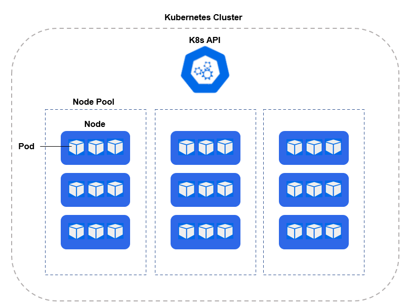

**Kubernetes, also known as K8s, is an open-source system for automating deployment, scaling and managing of  containerized apps.**

- Kubernetes is a virtualization layer of your servers that helps you deploy containers across a pool of computer resources.
- Kubernetes makes it easy to:
    - Deploy containers to shared resources.
    - Manage multiple replicas of your application onto a shared pool.
    - Scale up and scale down applications based on usage.

