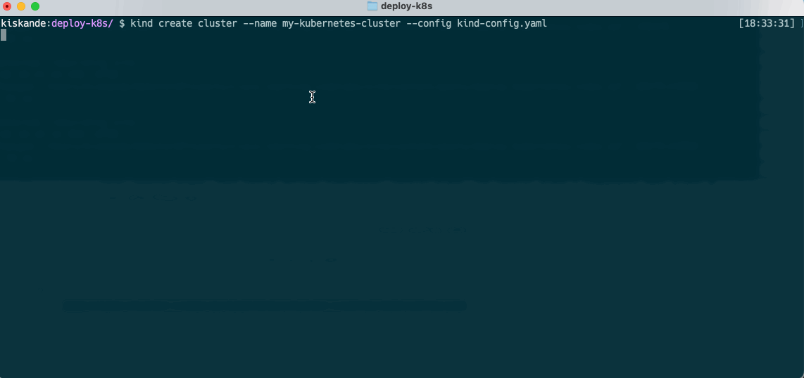

**Now that we have an understanding what K8s let's deploy our own cluster!**


**kind** is a tool for running local Kubernetes clusters using Docker container “nodes.”
kind was primarily designed for testing Kubernetes itself, but it may be used for local development or CI.

1. This sample cluster YAML file is used with `kind` to config and build our cluster.


- Save it to your local working directory


```yaml
kind: Cluster
apiVersion: kind.x-k8s.io/v1alpha4
nodes:
- role: control-plane
  extraPortMappings:
  - containerPort: 30201
    hostPort: 30201
    listenAddress: "0.0.0.0"
```

- The configuration file declaratively deploys Kubernetes within a container, and so we are defining:
	- `kind: Cluster`: This config merely specifies that we are configuring a kind cluster.
	- `role: control-plane`: This config defines the Kubernetes control plane. The control plane's components make global decisions about the cluster (for example, scheduling) as well as detecting and responding to cluster events.
	-  `extraPortMappings`: This config specifies the port mapping for our container so that we can reach our cluster.


2. It's time to deploy our first cluster! Leveraging the kind-config.yaml to do so:
 	- Open a new Terminal
 	- Navigate to the location of `kind-config.yaml` using `cd <directory>` in your Terminal
 	- Create the cluster by entering the following command in your Terminal

 ```bash
kind create cluster --name my-kubernetes-cluster --config kind-config.yaml
```



3. You now have a working Kubernetes cluster. Confirm that the `my-kubernetes-cluster` cluster was created, using your terminal execute:

```bash
kind get clusters
```

4. Configure `kubectl` so we can interact with it, in your terminal execute:
```bash
kubectl cluster-info --context kind-my-kubernetes-cluster
```

5. Let's get some information about our cluster using `kubectl`, in your terminal execute:
```bash
kubectl config view --minify --flatten --context=kind-my-kubernetes-cluster
```

